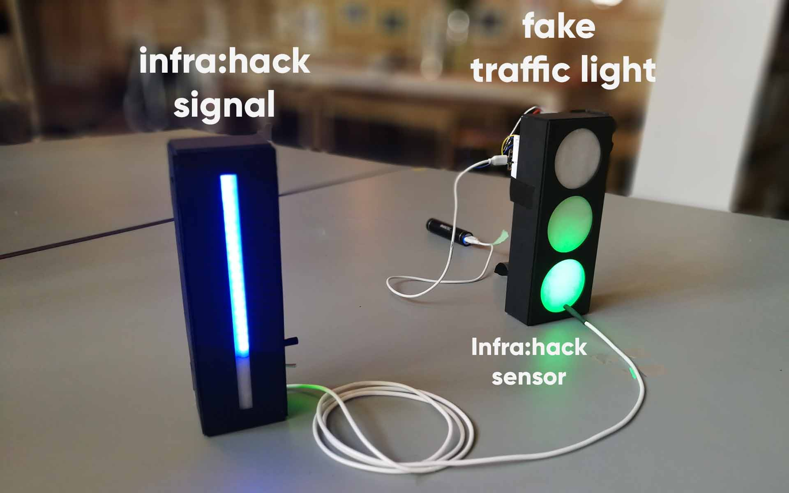

# About the idea
>**Greenlight District** is one of many project of the [CycleHack](https://www.cyclehack.com/) [Berlin 2018](http://cyclehackberlin.de/).

> One problem cyclists face in cities is the huge quantity of traffic lights that seemingly wait for them to come closer, so they can turn red right in front of them. In the end riders lose a lot of momentum and energy when the light turn finally green again. 

**How it works:** Greenlight helps to optimise the used energy so riders know they

- can keep the same pace
- should speed up to make the current green phase
- should slowing down to arrive at the next phase

# Greenlight District – infra:hack

- A sensor installed in the green light measures the duration of the green and red phases
- Both remaining times for the **current green** and the **red phase** are displayed in a line countdown that is visible several meters away from the traffic light

# Greenlight District – bike:hack

- Lights at the bike give with red and green light feedback how to adjust the speed to arrive at the next crossing with green.
- A rear light sends the same signal to following cyclists so they can make use of the same information of a traffic light, that might be even not visible yet.